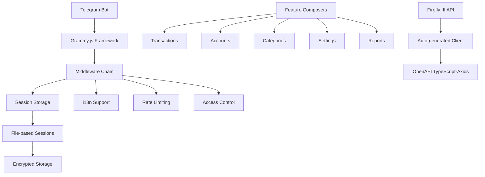

# Project Overview

A high-performance Telegram bot that provides mobile-first access to Firefly III personal finance management through conversational UI. Features natural language transaction processing with mathematical expression parsing, persistent session management, and multi-language support (EN/ES/IT/RU). Built with Grammy.js framework and TypeScript, offering seamless integration with Firefly III API for comprehensive financial tracking via Telegram.

## Repository Structure

- `src/` – Main TypeScript source code with modular composer architecture
- `src/composers/` – Feature-specific bot handlers (transactions, accounts, categories, reports, settings)
- `src/lib/` – Core libraries including auto-generated Firefly III API client and utilities
- `src/lib/firefly/` – Auto-generated OpenAPI client for Firefly III API integration
- `src/lib/menu-date-picker/` – Custom Grammy Menu-compatible date picker component
- `src/locales/` – Internationalization files for multi-language support
- `src/types/` – TypeScript type definitions and interfaces
- `memory_bank/` – Project documentation and context for AI agents
- `assets/` – Static assets including bot screenshots and branding
- `test/` – Test files and integration testing setup
- `.github/` – GitHub Actions CI/CD workflows and templates

## Build & Development Commands

```bash
# Install dependencies
npm install

# Start development server with hot reload
npm start

# Build TypeScript to JavaScript
npm run build

# Lint code with ESLint
npm run lint

# Fix linting issues automatically
npm run fix

# Generate Firefly III API client from OpenAPI spec
npm run codegen

# Update dependencies interactively
npm run update:i

# Copy locale files to dist (post-build)
npm run copylocales
```

## Code Style & Conventions

- **TypeScript**: Strict mode enabled with ES2016 target
- **Linting**: ESLint with TypeScript plugin, extends recommended rules
- **Formatting**: Consistent casing enforced, no unused parameters warnings disabled
- **File Structure**: Composer pattern for feature isolation, middleware chain architecture
- **Naming**: camelCase for variables/functions, PascalCase for types/interfaces
- **Session Keys**: Format `${user_id}_${chat_id}` for user-chat isolation
- **Commit Messages**: > TODO: Define commit message template

## Architecture Notes



The bot uses a middleware-driven architecture with Grammy.js framework. Core data flow: Message → Session Load → Middleware Chain → Feature Composer → API Integration → Session Save. Session management provides user-chat isolation with encrypted file storage. The Firefly III integration uses auto-generated TypeScript clients from OpenAPI specifications.

## Testing Strategy

> TODO: Testing is currently suspended per development directive. Test coverage paused to prioritize rapid functional development. Unit, integration, and e2e testing infrastructure exists but is not actively maintained.

## Security & Compliance

- **Access Control**: `ALLOWED_TG_USER_IDS` environment variable restricts bot access
- **Session Encryption**: File-based session storage with encryption support
- **Input Sanitization**: Mathematical expressions sanitized via mathjs library
- **Token Security**: Firefly III access tokens encrypted in session files
- **TLS Configuration**: `NODE_TLS_REJECT_UNAUTHORIZED=0` for self-signed certificates
- **License**: GPL-3.0-or-later open source license
- **Dependencies**: Regular security updates via npm-check-updates

## Agent Guardrails

- **Protected Files**: Never modify `src/lib/firefly/api/` or `src/lib/firefly/model/` (auto-generated)
- **Session Isolation**: Maintain `${user_id}_${chat_id}` session key format
- **API Rate Limits**: Respect 10 requests per 60 seconds with 5-second retry delays
- **State Management**: Preserve transaction state machine integrity (IDLE → AMOUNT_ENTRY → DESCRIPTION → CATEGORY_SELECTION → CONFIRMATION)
- **Required Reviews**: Changes to middleware chain, session management, or API integration patterns
- **Testing Suspension**: Do not write or run tests unless explicitly requested

## Extensibility Hooks

- **Environment Variables**: `BOT_TOKEN`, `FIREFLY_URL`, `FIREFLY_API_URL`, `FIREFLY_ACCESS_TOKEN`, `ALLOWED_TG_USER_IDS`, `DEBUG`, `DISABLE_UNAUTHORIZED_USER_LOG`
- **Feature Flags**: Language selection via session preferences, debug logging levels
- **Plugin Architecture**: Composer pattern allows modular feature addition
- **API Versioning**: OpenAPI client regeneration via `npm run codegen`
- **Localization**: Add new languages in `src/locales/` directory
- **Custom Components**: MenuDatePicker demonstrates custom Grammy Menu integration

## Further Reading

- [`memory_bank/projectbrief.md`](memory_bank/projectbrief.md) – Core project identity and requirements
- [`memory_bank/systemPatterns.md`](memory_bank/systemPatterns.md) – Architecture decisions and implementation patterns
- [`memory_bank/techContext.md`](memory_bank/techContext.md) – Development setup and technical stack
- [`memory_bank/activeContext.md`](memory_bank/activeContext.md) – Current development focus and recent changes
- [`memory_bank/progress.md`](memory_bank/progress.md) – Feature status and known limitations
- [`README.md`](README.md) – Setup instructions and deployment guide
- [Firefly III API Documentation](https://api-docs.firefly-iii.org) – External API reference