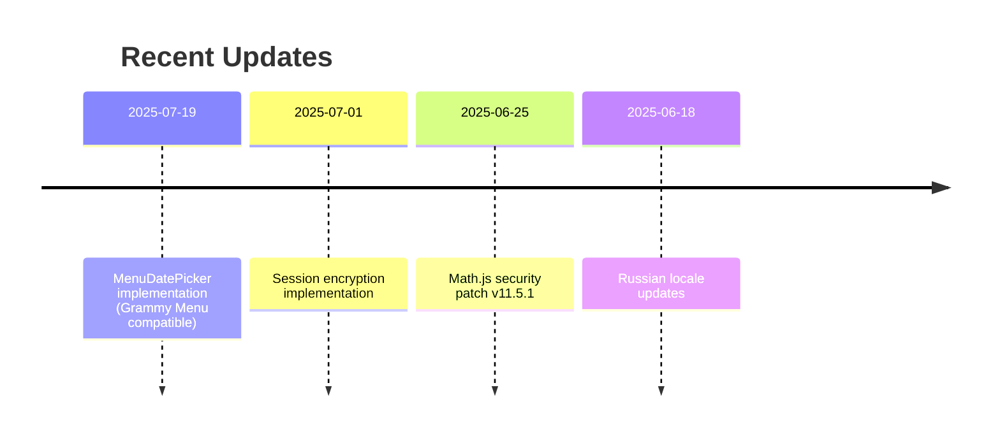

# Active Development Context

## Current Focus Areas
1. **Session Optimization**
   - File storage performance improvements
   - Cache invalidation strategies
   - Memory leak prevention

2. **Error Handling**
   - Enhanced API error recovery
   - User-friendly error messages
   - Session rollback mechanisms

## Recent Changes


## Key Technical Concepts
- **Transaction State Machine**:
  ```typescript
  type TransactionState = 
    | 'IDLE' 
    | 'AMOUNT_ENTRY'
    | 'DESCRIPTION'
    | 'CATEGORY_SELECTION'
    | 'CONFIRMATION'
  ```
  
- **API Rate Limiting**:
  ```typescript
  const API_RATE_LIMIT = {
    maxRequests: 10,
    perSeconds: 60,
    retryAfter: 5000
  }
  ```

- **MenuDatePicker State Management**:
  ```typescript
  interface DatePickerState {
    currentMonth: number;     // 0-11 (January = 0)
    currentYear: number;
    selectedDate?: string;    // YYYY-MM-DD format
    mode: 'month' | 'year';   // Current picker mode
  }
  ```

## Pending Tasks
- [x] Implement transaction date editing (completed with MenuDatePicker)
- [ ] Add multi-split transaction support
- [ ] Develop automated session cleanup

## Next Steps
1. **Immediate**:
   - Address open issues from GitHub repo
   - Update Firefly III API client to v1.5.7

2. **Roadmap**:
   - Q3 2025: Database session storage prototype
   - Q4 2025: Multi-user support architecture
