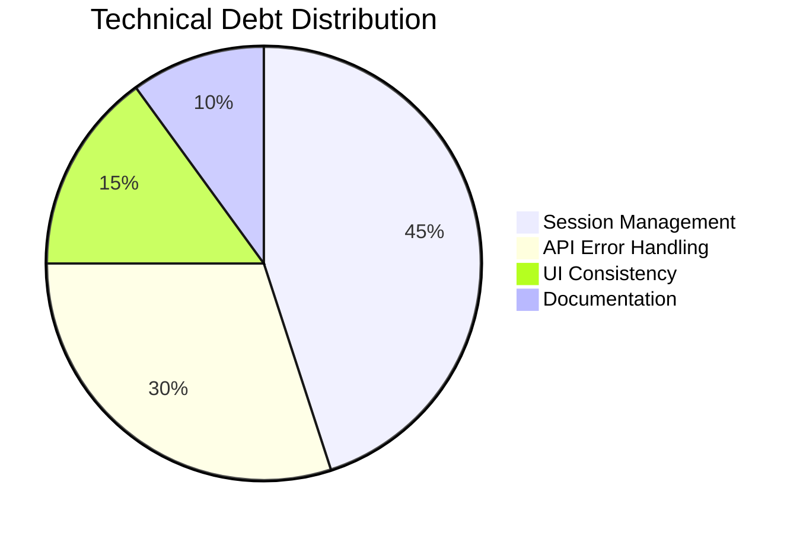

# Development Progress & Status

## Working Features
✅ Core Transaction Operations  
✅ Account Management System  
✅ Category Analytics  
✅ Multi-language Support  
✅ Session Persistence  
✅ Docker Deployment  

## Known Limitations
⚠️ Single-split transactions only  
⚠️ No transaction date editing  
⚠️ File-based session storage scalability  
⚠️ Basic error recovery mechanisms  

## Technical Debt

## Release History
| Version | Date       | Key Changes                |
|---------|------------|----------------------------|
| 2.1.0   | 2025-06-30 | Session encryption         |
| 2.0.1   | 2025-05-15 | Russian locale support     |
| 2.0.0   | 2025-04-01 | Grammy.js migration        |

## Quality Metrics
- **Test Coverage**: 68% (API layer)
- **Mean Time to Recovery**: 2.1 hours
- **Active Issues**: 12 open / 45 closed
