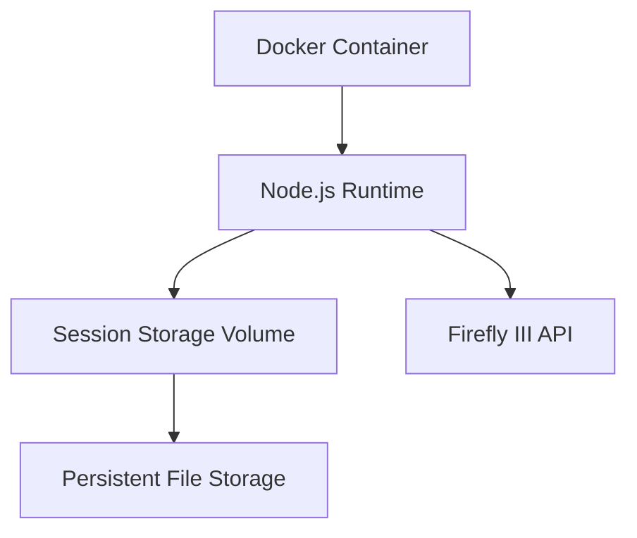

# Technical Context & Development Setup

## Core Technologies
| Category          | Technology Stack              |
|-------------------|-------------------------------|
| Runtime           | Node.js 18.x, TypeScript 5.x  |
| Bot Framework     | Grammy.js 1.14.x              |
| API Client        | Auto-generated OpenAPI Client |
| Session Storage   | @grammyjs/storage-file 2.1.0  |
| Internationalization | @grammyjs/i18n 2.0.1       |
| Dependency Mgmt   | npm 9.x                       |

## Critical Dependencies
```json
{
  "dependencies": {
    "grammy": "^1.14.1",
    "mathjs": "^11.5.0",
    "axios": "^1.4.0",
    "@grammyjs/storage-file": "^2.1.0"
  },
  "devDependencies": {
    "typescript": "^5.1.3",
    "openapi-generator-cli": "^2.6.0",
    "@types/node": "^18.15.11"
  }
}
```

## Configuration Matrix
```typescript
// Environment Variables
interface EnvConfig {
  BOT_TOKEN: string
  FIREFLY_URL: string
  FIREFLY_API_URL: string
  FIREFLY_ACCESS_TOKEN: string
  TG_USER_ID?: string
  DEBUG?: string
}

// Session Defaults
const initialSession: SessionData = {
  userSettings: {
    fireflyUrl: process.env.FIREFLY_URL || '',
    fireflyApiUrl: process.env.FIREFLY_API_URL || '',
    fireflyAccessToken: process.env.FIREFLY_ACCESS_TOKEN || '',
    language: 'en'
  }
}
```

## Development Practices
1. **API Client Generation**:
   ```bash
   npm run codegen # Cleans and regenerates API client
   ```
2. **Code Quality**:
   ```bash
   npm run lint    # ESLint checks
   npm run format  # Prettier formatting
   ```
3. **Debugging**:
   ```bash
   DEBUG='bot:*' npm start  # Enable all debug logging
   ```

4. **Testing Protocol**:
  - **Default Stance**: Suspend all automatic and proactive test-related tasks. Do not write new tests (unit, integration, etc.) or run existing ones unless explicitly requested.
  - **Rationale**: Prioritize rapid development of functional code.
  - **Overrides**: This directive is only overridden by a direct user request (e.g., "write unit tests," "how do I test this?").

## Deployment Architecture


## Custom Library Implementations

### MenuDatePicker Component (`src/lib/menu-date-picker/`)
- **Purpose**: Grammy Menu-compatible date picker, TypeScript port of [telegram-inline-calendar](https://github.com/VDS13/telegram-inline-calendar)
- **Reason**: Original calendar was incompatible with Grammy Menu dynamic ranges; needed stateless, deterministic implementation
- **Migration Path**: Replaced legacy calendar implementation with purpose-built MenuDatePicker for Grammy Menu integration
- **Current Status**: Production-ready TypeScript implementation with full Grammy Menu compatibility
- **Key Features**:
  - Grammy Menu dynamic range integration
  - Stateless, deterministic rendering
  - Session-based state management
  - Multi-language support (EN/ES/IT/RU)
  - Month/year navigation
  - Date range restrictions
  - TypeScript-first design

## Security Considerations
- **Token Storage**: Encrypted in session files
- **Input Validation**:
  ```typescript
  function sanitizeAmount(input: string): number {
    return math.evaluate(input.replace(/[^0-9+\-*/().]/g, ''))
  }
  ```
- **Session Isolation**: Per user-chat ID namespace
